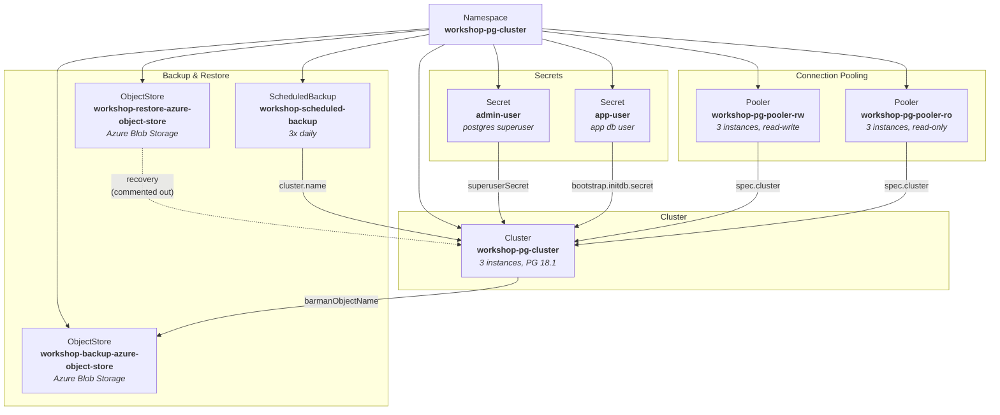

# CNPG Workshop

CloudNativePG workshop setup with a PostgreSQL cluster, connection pooling, automated backups, and monitoring.

## Kubernetes Resource Structure



## Directory Layout

```
development/
├── database/
│   ├── kustomization.yaml        # Kustomize composition
│   ├── namespace.yaml            # Namespace
│   ├── cluster.yaml              # CNPG Cluster (3 replicas, PG 18.1)
│   ├── db-admin.secret.yaml      # Superuser credentials
│   ├── db-user.secret.yaml       # App user credentials
│   ├── backup.yaml               # ScheduledBackup (08:00, 12:00, 18:00 UTC)
│   ├── backup.objectstore.yaml   # Backup target (Azure Blob)
│   ├── restore.objectstore.yaml  # Restore source (Azure Blob)
│   ├── rw.pooler.yaml            # Read-write connection pooler
│   ├── ro.pooler.yaml            # Read-only connection pooler
│   └── podmonitor.yaml           # Prometheus PodMonitor
└── pgadmin/
    └── .gitkeep
```

*The storage account in this workshop is using LRS redundancy option.*

When setting up storage account in production for backups:

use at least ZRS (Zone-Redundant Storage) to protect against zone failures. GRS (Geo-Redundant Storage) is recommended for cross-region durability.


