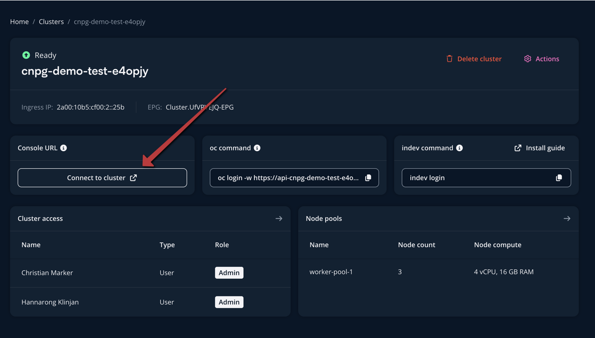
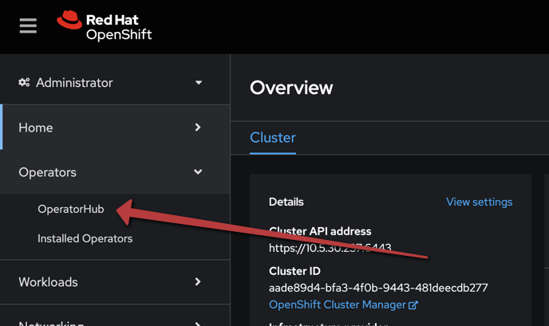
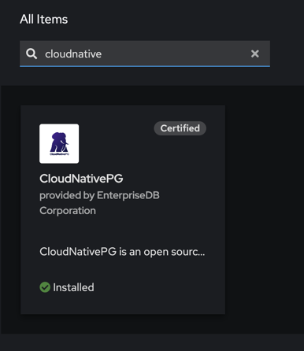
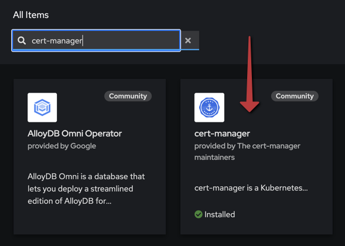
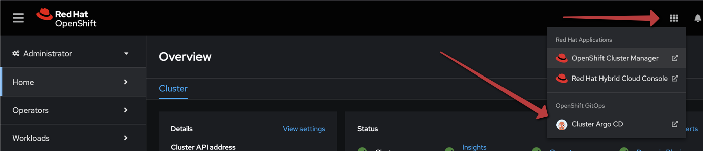
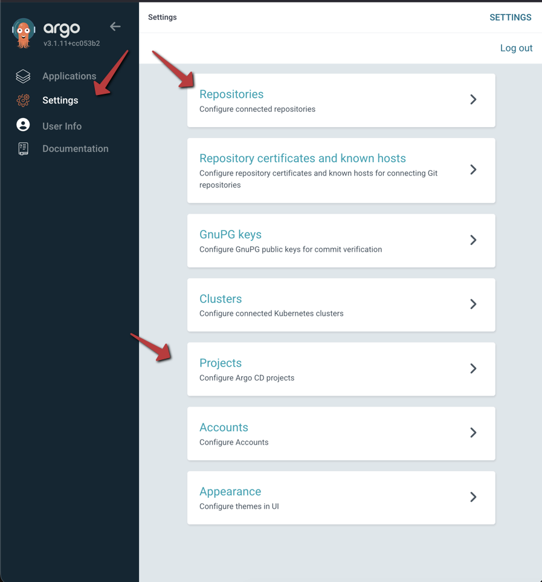
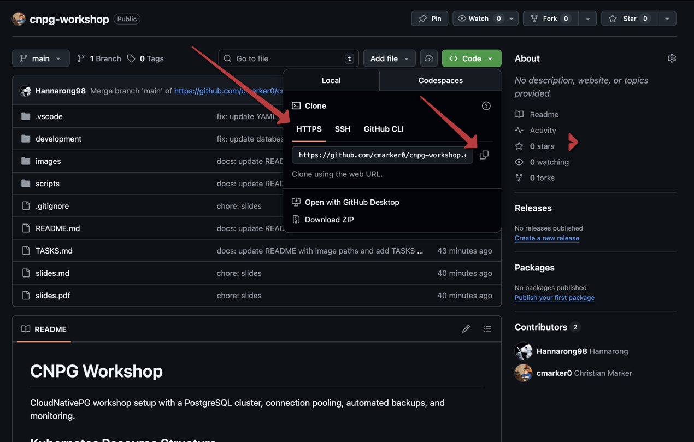
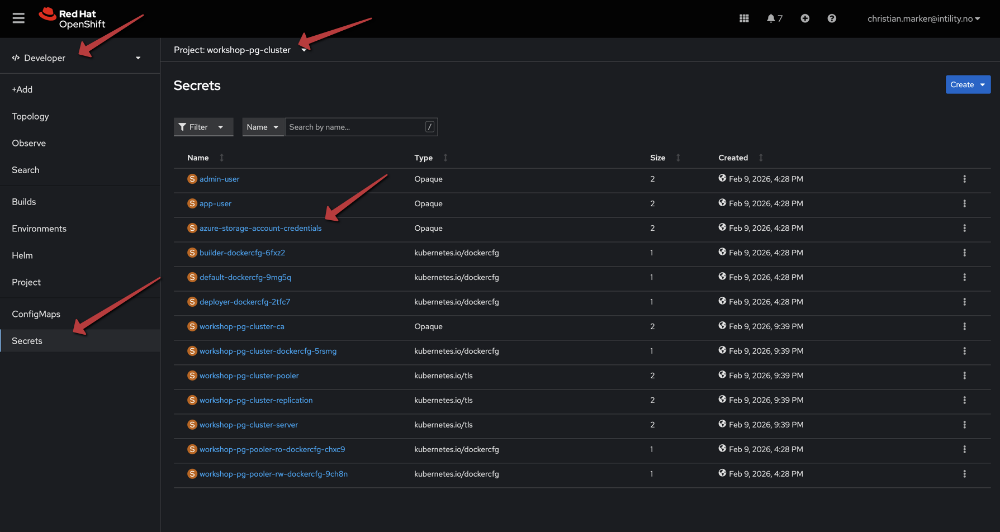
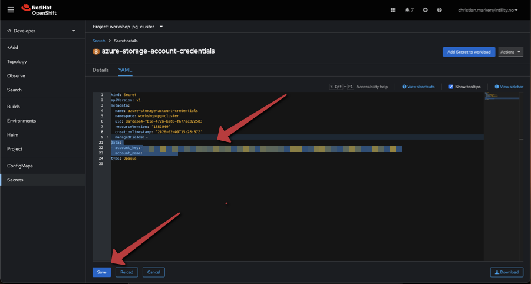

# CNPG Workshop

## Forutsetninger

Du har ett OpenShift cluster tilgjengelig, og har tilgang til å installere operatorer og applikasjoner i det.

## Oppgaver

Naviger til Developer platform: <https://developers.intility.com/clusters> og finn ditt cluster. Klikk på "Open OpenShift Console" for å åpne OpenShift dashboardet.



Installer disse verktøyene/operatorene i OpenShift OperatorHub:



|Navn|Bilde|
|----|----|
|CloudNativePG||
|cert-manager||

## Installere ArgoCD

**Manuelt:**

<https://developers.intility.com/docs/development/argocd/install-argocd/#prerequisites>

**Claude:**

```bash
(claude plugin marketplace add git@github.com:intility/claude-plugins.git || true) && claude plugin install developer-platform-companion@intility-claude-plugins && claude "help me setup argocd in openshift cluster"
```

Enable Helm-støtte: endre på operatoren `kustomizeBuildOptions: --enable-helm` (samme nivå som `rbac` f.eks.)

## GitOps-prosjekt

- Fork: <https://github.com/cmarker0/cnpg-workshop/tree/main>
- Endre på backup destination i: `development/database/backup.objectstore.yaml`

## ArgoCD - Del 1

Åpne ArgoCD:





- Opprett prosjekt
  - Navn: `cnpg-workshop`
- Opprett repository
  - Connection Method: `HTTP/HTTPS`
  - Name: `cnpg-workshop`
  - Project: `cnpg-workshop`
  - Repository URL: `<URL til din fork av cnpg-workshop repo>`



- Opprett applikasjon
  - Application Name: `appset`
  - Project: Velg `cnpg-workshop` fra dropdown
  - SOURCE -> Reository URL: Velg URLen til din fork fra dropdown
  - Path: `development`
  - Cluster: Velg clusteret ditt fra dropdown
  - CREATE
- Sync `database_infra` applikasjonen. Denne oppretter `namespace` og `secret` som vi trenger for å koble til Azure Blob Storage.

## OpenShift Console

Endre på secret `azure-storage-account-credentials` i `workshop-pg-cluster` namespace for å legge inn riktige credentials for Azure Blob Storage. Denne vil bli tilsendt på chat.

|Steg|Bilde|
|---|---|
|Finn secret `azure-storage-account-credentials` i `workshop-pg-cluster` namespace||
|Rediger secret og legg inn credentials||

## ArgoCD - Del 2

Vi er nå klare til å spinne opp resten av infrastrukturen for CNPG workshop:

1. Sync resterende applikasjoner i ArgoCD: `database`, `barman` og `pgadmin`.

## pgAdmin

1. [Create database tables](database/create-tables.md)
2. [Populate database tables](database/populate-tables.md)

## Backup og restore

TODO: fiks
