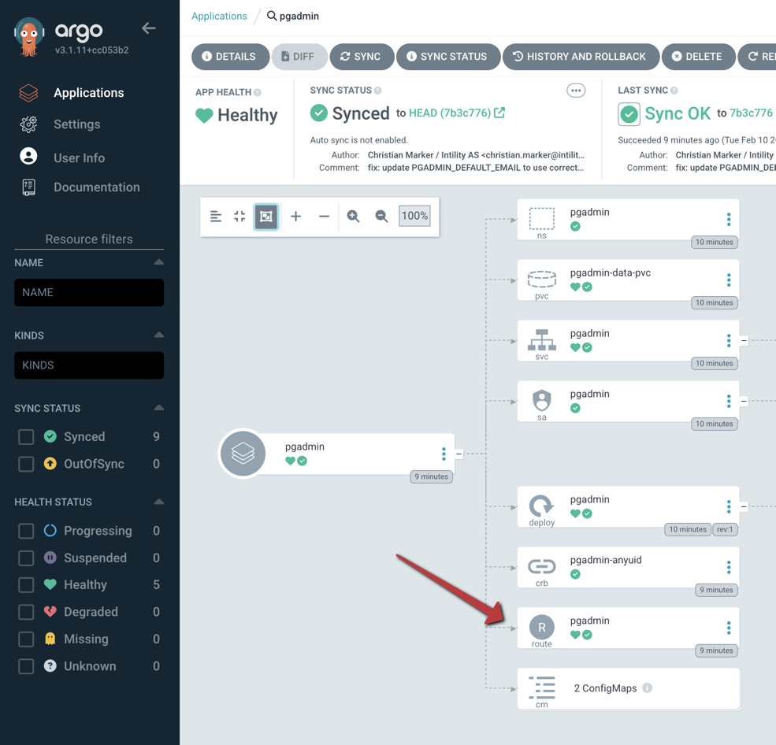
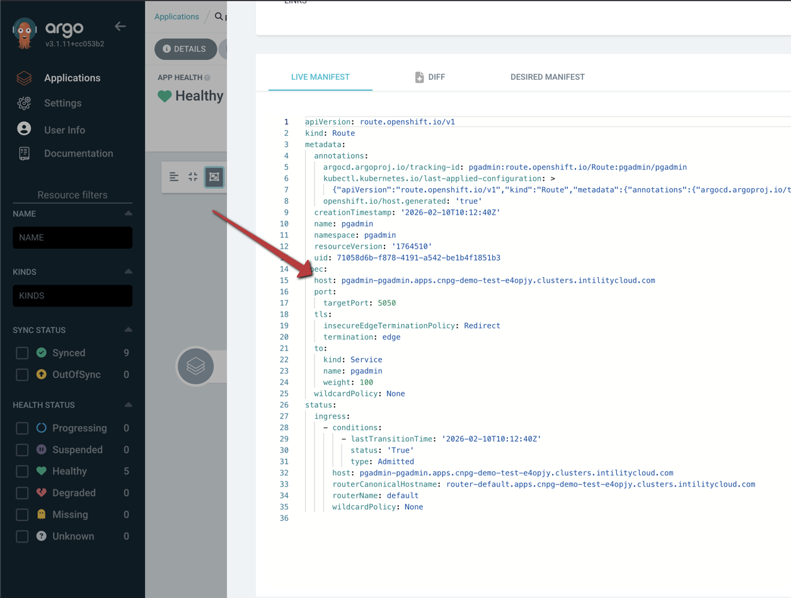
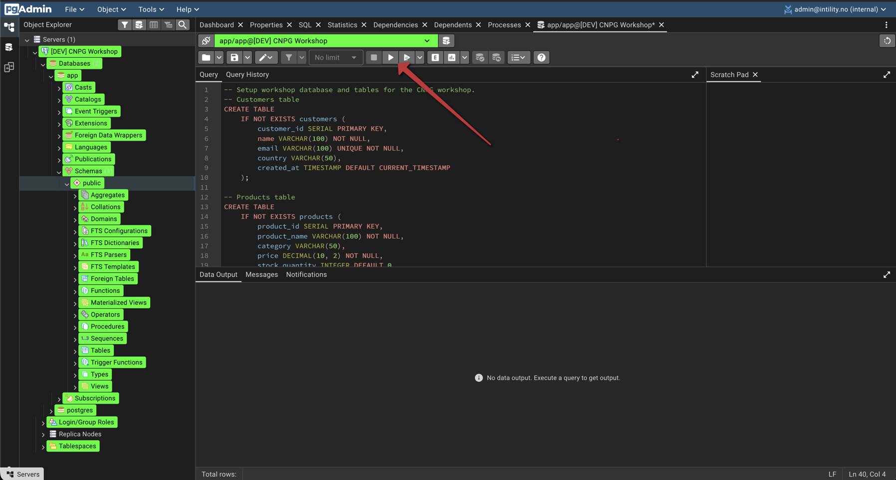
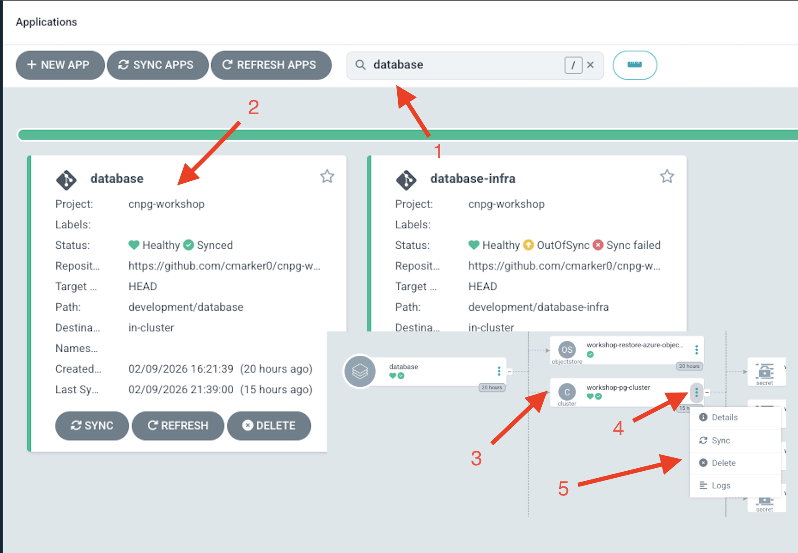
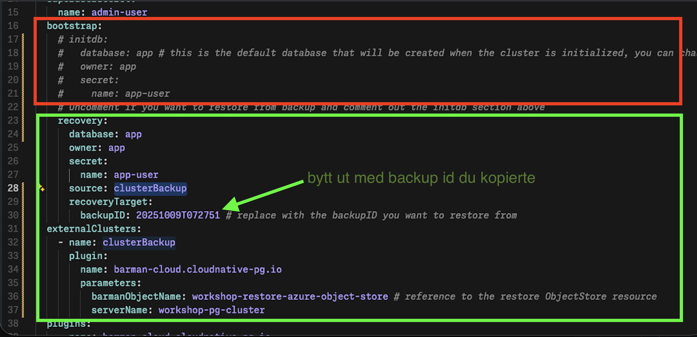

# CNPG Workshop

## Forutsetninger

Du har ett OpenShift cluster tilgjengelig, og har tilgang til å installere operatorer og applikasjoner i det.

## Oppgaver

Naviger til Developer platform: <https://developers.intility.com/clusters> og finn ditt cluster. Klikk på "Open OpenShift Console" for å åpne OpenShift dashboardet.


Installer disse verktøyene/operatorene i OpenShift OperatorHub:


|Navn|Bilde|
|----|----|
|CloudNativePG||
|cert-manager||

## Installere ArgoCD

**Manuelt:**

<https://developers.intility.com/docs/development/argocd/install-argocd/#prerequisites>

**Claude:**

```bash
(claude plugin marketplace add git@github.com:intility/claude-plugins.git || true) && claude plugin install developer-platform-companion@intility-claude-plugins && claude "help me setup argocd in openshift cluster"
```

Enable Helm-støtte: endre på operatoren `kustomizeBuildOptions: --enable-helm` (samme nivå som `rbac` f.eks.)

## GitOps-prosjekt

- Fork: <https://github.com/cmarker0/cnpg-workshop/tree/main>
- Endre på backup destination i: `development/database/backup.objectstore.yaml`

## ArgoCD - Del 1

Åpne ArgoCD:


- Opprett prosjekt
  - Navn: `cnpg-workshop`
- Opprett repository
  - Connection Method: `HTTP/HTTPS`
  - Name: `cnpg-workshop`
  - Project: `cnpg-workshop`
  - Repository URL: `<URL til din fork av cnpg-workshop repo>`


- Opprett applikasjon
  - Application Name: `appset`
  - Project: Velg `cnpg-workshop` fra dropdown
  - SOURCE -> Reository URL: Velg URLen til din fork fra dropdown
  - Path: `development`
  - Cluster: Velg clusteret ditt fra dropdown
  - CREATE
- Sync `database_infra` applikasjonen. Denne oppretter `namespace` og `secret` som vi trenger for å koble til Azure Blob Storage.

## OpenShift Console

Endre på secret `azure-storage-account-credentials` i `workshop-pg-cluster` namespace for å legge inn riktige credentials for Azure Blob Storage. Denne vil bli tilsendt på chat.

|Steg|Bilde|
|---|---|
|Finn secret `azure-storage-account-credentials` i `workshop-pg-cluster` namespace||
|Rediger secret og legg inn credentials||

## ArgoCD - Del 2

Vi er nå klare til å spinne opp resten av infrastrukturen for CNPG workshop:

1. Sync resterende applikasjoner i ArgoCD: `database`, `barman` og `pgadmin`.
   - `database` applikasjonen oppretter en CNPG cluster med 3 noder.
   - `barman` applikasjonen oppretter en Barman for Postgres cluster som tar backup av CNPG clusteret og lagrer det i Azure Blob Storage.
   - `pgadmin` applikasjonen oppretter en pgAdmin instans som vi kan bruke for å koble til CNPG clusteret og utføre SQL queries.

## pgAdmin

Finn autogenerert URL for pgAdmin applikasjonen:





Logg på med følgende credentials:
- Email: `admin@intility.no`
- Password: `admin`

Koble til serveren ved å skrive inn passordet `app`.


Åpne Query Tool ved å klikke på ikonet i verktøylinjen:


Lim inn SQL-scriptene og kjør dem med Execute-knappen:

### Database queries



1. [Create database tables](scripts/create-tables.sql)
2. [Populate database tables with demo data](scripts/populate-database.sql)

Det ligger flere SQL-scripts i `scripts`-mappen som du kan utforske og kjøre i pgAdmin.

## Backup og restore
  1. Opprett backup i openshift og vent til at backup er ferdig gjennomført
  
  
  
  
  
  
  2. Kopier backup id ligger litt langt ned
  3. Kjør SQL scriptet fra `generate-wal-load.sql` i pgadmin, merk at dette kjøres etter backupen er ferdig
  4. Dra ned clusteret, vi skal ta en restore men cnpg støtter ikke in place recovery så alt må spinnes opp på nytt som at vi spunnet opp en init cluster. Vi kan slette clusteret via argocd guiet slik:




  5.Commit endringene og push